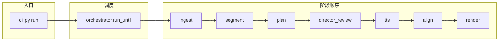

# novel2comic 代码结构树形图

> 本文档维护项目代码目录与模块的树形结构，便于快速定位与理解。

---

## 1. Mermaid 树形图（推荐）

在支持 Mermaid 的 Markdown 预览中可渲染为可交互图表（GitHub、VS Code、Typora 等）。

```mermaid
flowchart TB
    ROOT["novel2comic/"]

    ROOT --> SRC["src/novel2comic/"]
    ROOT --> SCRIPTS["scripts/"]
    ROOT --> TESTS["tests/"]
    ROOT --> DOCS["docs/"]

    SRC --> CORE["core/"]
    SRC --> PIPELINE["pipeline/"]
    SRC --> STAGES["stages/"]
    SRC --> DIRECTOR["director_review/"]
    SRC --> SKILLS["skills/"]
    SRC --> PROVIDERS["providers/"]

    CORE --> C1["io.py"]
    CORE --> C2["manifest.py"]
    CORE --> C3["split_baseline.py"]
    CORE --> C4["quote_splitter.py"]
    CORE --> C5["speech_schema.py"]
    CORE --> C6["tts_utils.py"]
    CORE --> C7["audio_utils.py"]
    CORE --> C8["schemas/"]

    STAGES --> S1["ingest.py"]
    STAGES --> S2["segment.py"]
    STAGES --> S3["plan.py"]
    STAGES --> S4["director_review.py"]
    STAGES --> S5["tts.py"]
    STAGES --> S6["align.py"]
    STAGES --> S7["render.py"]

    PIPELINE --> P1["orchestrator.py"]

    DIRECTOR --> D1["schema.py"]
    DIRECTOR --> D2["prompt.py"]
    DIRECTOR --> D3["client.py"]
    DIRECTOR --> D4["apply.py"]
    DIRECTOR --> D5["fallback.py"]

    SKILLS --> K1["refine_shot_split/"]
    SKILLS --> K2["speech_plan/"]

    PROVIDERS --> V1["llm/"]
    PROVIDERS --> V2["tts/"]
```



---

## 2. 流水线调用关系（Mermaid）



---

## 3. ASCII 树形图（纯文本）

```
novel2comic/
├── pyproject.toml
├── README.md
├── .env                    # 密钥（不提交）
│
├── src/novel2comic/        # 核心包
│   ├── __init__.py
│   ├── __main__.py         # python -m novel2comic
│   ├── cli.py              # 命令行：init / prepare / run
│   │
│   ├── core/               # 基础层（无业务依赖）
│   │   ├── io.py           # ChapterPaths、find_project_root
│   │   ├── manifest.py     # 状态机、断点续跑
│   │   ├── split_baseline.py
│   │   ├── quote_splitter.py
│   │   ├── speech_schema.py
│   │   ├── tts_utils.py
│   │   ├── audio_utils.py
│   │   └── schemas/
│   │       ├── __init__.py
│   │       └── shot.py
│   │
│   ├── pipeline/
│   │   ├── __init__.py
│   │   └── orchestrator.py # 阶段调度
│   │
│   ├── stages/             # 阶段实现
│   │   ├── base.py         # StageContext
│   │   ├── ingest.py
│   │   ├── segment.py
│   │   ├── plan.py
│   │   ├── director_review.py
│   │   ├── tts.py
│   │   ├── align.py
│   │   └── render.py
│   │
│   ├── director_review/    # 导演审阅模块
│   │   ├── __init__.py
│   │   ├── schema.py
│   │   ├── prompt.py
│   │   ├── client.py
│   │   ├── apply.py
│   │   └── fallback.py
│   │
│   ├── skills/
│   │   ├── refine_shot_split/   # 分镜语义修正
│   │   │   ├── schema.py
│   │   │   ├── skill.py
│   │   │   ├── prompt.py
│   │   │   ├── applier.py
│   │   │   └── validator.py
│   │   └── speech_plan/         # 朗读参数 patch
│   │       ├── schema.py
│   │       ├── skill.py
│   │       ├── prompt.py
│   │       ├── applier.py
│   │       └── validator.py
│   │
│   └── providers/
│       ├── llm/
│       │   └── siliconflow_client.py
│       ├── tts/
│       │   └── siliconflow_tts.py
│       ├── image/          # 占位
│       ├── align/           # 占位
│       ├── render/          # 占位
│       └── export/          # 占位
│
├── scripts/                # 独立脚本（预处理、调试）
│   ├── split_novel_to_chapters.py
│   ├── normalize_to_utf8.py
│   ├── normalize_chapter_indent.py
│   ├── debug_refine_split.py
│   ├── smoke_director_review.py
│   ├── smoke_tts_cosyvoice2.py
│   └── smoke_audio_pipeline.py
│
├── tests/
│   ├── test_core.py
│   ├── test_pipeline.py
│   ├── test_director_review.py
│   ├── test_tts_utils.py
│   ├── test_speech_plan.py
│   ├── test_skills.py
│   ├── test_align_lite.py
│   ├── test_quote_splitter.py
│   ├── test_tts_style_prompt.py
│   ├── test_voice_select.py
│   └── test_scripts.py
│
├── docs/
│   ├── ARCHITECTURE.md
│   ├── CONFIG_REFERENCE.md
│   ├── NAMING_CONVENTIONS.md
│   ├── CHANGELOG.md
│   └── CODE_STRUCTURE.md   # 本文档
│
├── configs/
│   └── README.md
│
└── output/                 # 产物目录（运行时生成）
    └── <novel_id>/
        └── <chapter_id>/   # ChapterPack
```

---

## 4. 模块职责速查

| 路径 | 职责 |
|------|------|
| `core/io.py` | ChapterPaths、effective_shotscript、find_project_root |
| `core/manifest.py` | Manifest 读写、STAGES、set_stage、mark_done |
| `core/split_baseline.py` | 规则粗切章节 → base_shots |
| `core/quote_splitter.py` | 按引号切分 narration/quote |
| `core/speech_schema.py` | PACE_TO_SPEED、cosyvoice2_short_instruction |
| `core/tts_utils.py` | normalize_tts_input、get_tail_pause_ms |
| `core/audio_utils.py` | concat_wavs_with_pauses、wav_duration_ms、_ensure_wav |
| `pipeline/orchestrator.py` | STAGE_ORDER、run_until |
| `stages/*.py` | 各阶段 run(paths, ctx) |
| `director_review/*.py` | 导演审阅 schema/prompt/client/apply/fallback |
| `skills/refine_shot_split` | LLM 分镜语义修正 |
| `skills/speech_plan` | LLM 朗读参数 patch |
| `providers/llm` | SiliconFlow chat_json |
| `providers/tts` | SiliconFlow TTS、CosyVoice2 |

---

## 5. 依赖方向

```
cli → pipeline → stages
stages → core, providers, skills, director_review
skills → core
director_review → core
providers → core（仅 audio_utils._ensure_wav）
```

---

*最后更新：2026-03-01*
