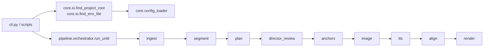

# novel2comic 代码结构（CODE_STRUCTURE）

> 本文档描述当前代码目录、模块职责与主要调用链路。以仓库当前实现为准。

---

## 1. 顶层结构

```text
novel2comic/
├── pyproject.toml
├── requirements.txt
├── README.md
├── .env                       # 本地密钥文件（不提交）
├── configs/
├── docs/
├── scripts/
├── src/novel2comic/
└── tests/
```

---

## 2. Mermaid 结构图

```mermaid
flowchart TB
    ROOT["novel2comic/"]

    ROOT --> CFG["configs/"]
    ROOT --> DOCS["docs/"]
    ROOT --> SCRIPTS["scripts/"]
    ROOT --> SRC["src/novel2comic/"]
    ROOT --> TESTS["tests/"]

    SRC --> CORE["core/"]
    SRC --> PIPE["pipeline/"]
    SRC --> STAGES["stages/"]
    SRC --> DIRECTOR["director_review/"]
    SRC --> SKILLS["skills/"]
    SRC --> PROVIDERS["providers/"]

    CORE --> IO["io.py"]
    CORE --> CFGLOADER["config_loader.py"]
    CORE --> MANIFEST["manifest.py"]
    CORE --> AUDIO["audio_utils.py"]
    CORE --> TTSUTIL["tts_utils.py"]
    CORE --> PROMPT["image_prompt.py"]
    CORE --> QC["image_qc.py"]

    STAGES --> INGEST["ingest.py"]
    STAGES --> SEGMENT["segment.py"]
    STAGES --> PLAN["plan.py"]
    STAGES --> REVIEW["director_review.py"]
    STAGES --> ANCHORS["anchors_generate.py"]
    STAGES --> IMAGE["image_generate.py"]
    STAGES --> TTS["tts.py"]
    STAGES --> ALIGN["align.py"]
    STAGES --> RENDER["render.py"]

    PROVIDERS --> LLM["llm/"]
    PROVIDERS --> PTTS["tts/"]
    PROVIDERS --> PIMG["image/"]
    PROVIDERS --> PVLM["vlm/"]
```



---

## 3. 实际调用链路



说明：
- `anchors` 已经是正式阶段，不是文档占位。
- 当前代码里 `image` 在 `tts` 之前。
- 配置与 `.env` 解析已经从“依赖当前工作目录 / 固定路径”改为统一走 `core/io.py`。

---

## 4. ASCII 树形图

```text
src/novel2comic/
├── __init__.py
├── __main__.py
├── cli.py
├── core/
│   ├── io.py
│   ├── config_loader.py
│   ├── manifest.py
│   ├── split_baseline.py
│   ├── quote_splitter.py
│   ├── speech_schema.py
│   ├── tts_utils.py
│   ├── audio_utils.py
│   ├── image_prompt.py
│   ├── image_qc.py
│   ├── image_review_schema.py
│   └── schemas/
├── pipeline/
│   └── orchestrator.py
├── stages/
│   ├── base.py
│   ├── ingest.py
│   ├── segment.py
│   ├── plan.py
│   ├── director_review.py
│   ├── anchors_generate.py
│   ├── image_generate.py
│   ├── tts.py
│   ├── align.py
│   └── render.py
├── director_review/
│   ├── schema.py
│   ├── prompt.py
│   ├── client.py
│   ├── apply.py
│   └── fallback.py
├── skills/
│   ├── refine_shot_split/
│   └── speech_plan/
└── providers/
    ├── llm/
    │   └── siliconflow_client.py
    ├── tts/
    │   └── siliconflow_tts.py
    ├── image/
    │   ├── image_qwen.py
    │   └── image_flux.py
    └── vlm/
        ├── siliconflow_vlm.py
        └── prompts/
```

---

## 5. 模块职责速查

| 路径 | 职责 |
|------|------|
| `core/io.py` | 目录约定、项目根目录与 `.env` 自动定位 |
| `core/config_loader.py` | YAML + 环境变量覆盖 |
| `core/manifest.py` | 阶段状态与断点续跑 |
| `pipeline/orchestrator.py` | 统一阶段调度 |
| `stages/segment.py` | baseline + refine 生成 ShotScript |
| `stages/plan.py` | 生成 `shot.speech` |
| `stages/director_review.py` | 合并导演审阅 patch |
| `stages/anchors_generate.py` | 生成角色 / 风格锚点 |
| `stages/image_generate.py` | 生成镜头图像 |
| `stages/tts.py` | 生成 shot 音频与 chapter 音频 |
| `stages/align.py` | 生成 ASS / SRT |
| `stages/render.py` | 生成 preview.mp4 |
| `providers/llm` | LLM JSON 输出封装 |
| `providers/tts` | TTS 请求与音色选择 |
| `providers/image` | Qwen / FLUX 图像生成 |
| `providers/vlm` | 图像质量审查 / recheck |

---

## 6. 依赖方向

```text
cli / scripts -> pipeline -> stages
stages -> core, providers, skills, director_review
providers -> core.io, core.config_loader
skills -> core
director_review -> core
```

补充说明：
- `providers` 现在允许依赖 `core.io.find_project_root()` / `find_env_file()`，这是为了统一跨机器运行时的路径解析。
- 项目禁止依赖某台机器上的绝对目录结构。

---

## 7. 与本次改造相关的文件

这次为了支持“本地 Windows + 云服务器”共用代码，重点调整了：
- `src/novel2comic/core/io.py`
- `src/novel2comic/core/config_loader.py`
- `src/novel2comic/providers/llm/siliconflow_client.py`
- `src/novel2comic/providers/tts/siliconflow_tts.py`
- `src/novel2comic/providers/image/image_qwen.py`
- `src/novel2comic/providers/image/image_flux.py`
- `src/novel2comic/providers/vlm/siliconflow_vlm.py`
- `scripts/smoke_full_chain.py`
- `tests/test_core.py`

---

*最后更新：2026-03-07*